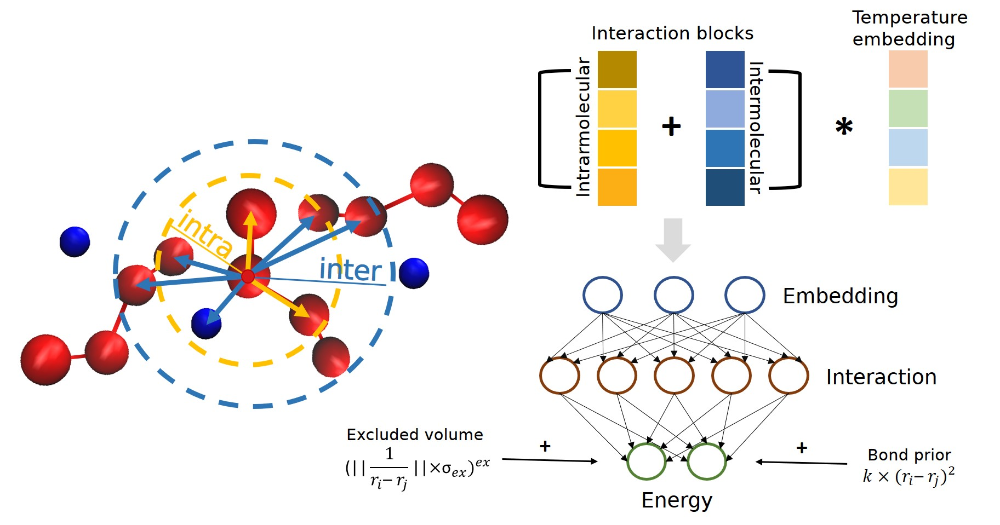

# Temperature transferable Neural Force Field (TNFF) for coarse-grained molecular dynamics simulations

Implementation of the temperature transferable neural force field from our paper https://arxiv.org/abs/2007.14144

<p align="center">
  
</p>

The model is based on SchNet [1-4]. It provides an interface to train and evaluate neural networks for force fields, specifically tested on coarse-grained ionic liquid simulations

## Usage

Three notebooks run through the workflow of the paper

 - Part1_cg_mapping.ipynb
  Uses [coarse-grained auto-encoders](https://github.com/learningmatter-mit/Coarse-Graining-Auto-encoders) for determening the best mapping for the ionic liquid. Uses MD data from LAMMPS with a [force field for ionic liquids](https://github.com/agiliopadua/ilff).
 - Part2_data_file_creation.ipynb
  Using the previously mentioned data and the newly generated coarse-grained mapping preparing the data for training, applying the coarse-grained filter for the training data.
 - Part3_temp_transfer.ipynb
  Training the model and running MD simulations on ASE. The hyperparameters in the model are the ones from the best run, though the data is not the full dataset.

## Installation from source

This software requires the following packages:

- [PyTorch=1.4](http://pytorch.org)
- [scikit-learn](http://scikit-learn.org/stable/)
- [ase=3.18](https://wiki.fysik.dtu.dk/ase/)
- [networkx=2.3](https://networkx.github.io/)

We highly recommend to create a `conda` environment to run the code. To do that, use the following commands:

```bash
conda upgrade conda
conda create -n nff python=3.7 scikit-learn pytorch>=1.2.0 cudatoolkit=10.0 ase pandas pymatgen -c pytorch -c conda-forge
```

You need to activate the `tnff` environment to install the NFF package:

```bash
conda activate nff
```

Finally, install the `tnff` package by running:

```bash
pip install .
```


## References

* [1] K.T. Schütt. F. Arbabzadah. S. Chmiela, K.-R. Müller, A. Tkatchenko.  
*Quantum-chemical insights from deep tensor neural networks.*
Nature Communications **8**. 13890 (2017)   
[10.1038/ncomms13890](http://dx.doi.org/10.1038/ncomms13890)

* [2] K.T. Schütt. P.-J. Kindermans, H. E. Sauceda, S. Chmiela, A. Tkatchenko, K.-R. Müller.  
*SchNet: A continuous-filter convolutional neural network for modeling quantum interactions.*
Advances in Neural Information Processing Systems 30, pp. 992-1002 (2017) [link](http://papers.nips.cc/paper/6700-schnet-a-continuous-filter-convolutional-neural-network-for-modeling-quantum-interactions)

* [3] K.T. Schütt. P.-J. Kindermans, H. E. Sauceda, S. Chmiela, A. Tkatchenko, K.-R. Müller.  
*SchNet - a deep learning architecture for molecules and materials.* 
The Journal of Chemical Physics 148(24), 241722 (2018) [10.1063/1.5019779](https://doi.org/10.1063/1.5019779)

* [4] K.T. Schütt, P. Kessel, M. Gastegger, K. Nicoli, A. Tkatchenko, K.-R. Müller.
*SchNetPack: A Deep Learning Toolbox For Atomistic Systems.*
J. Chem. Theory Comput. **15**(1), 448-455 (2019). [10.1021/acs.jctc.8b00908](https://doi.org/10.1021/acs.jctc.8b00908)
